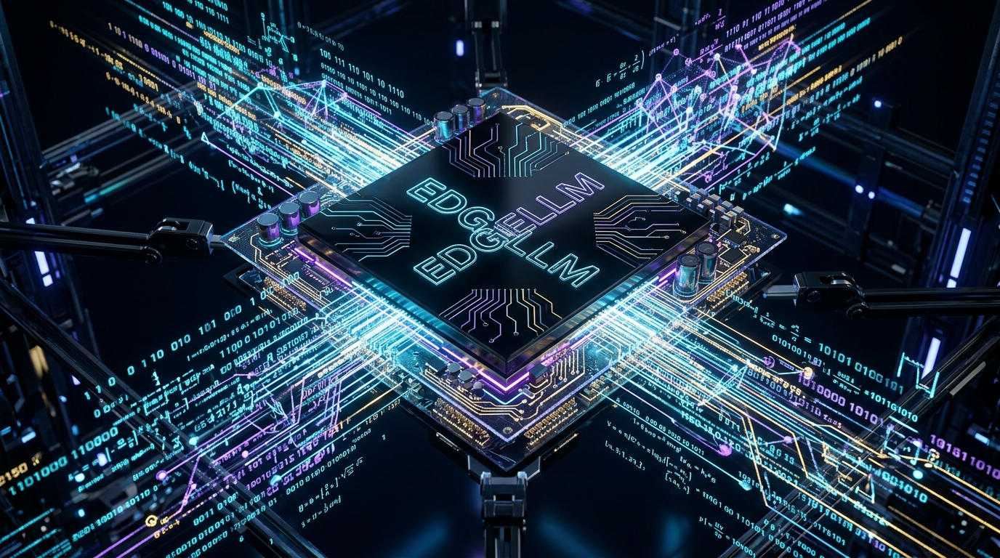
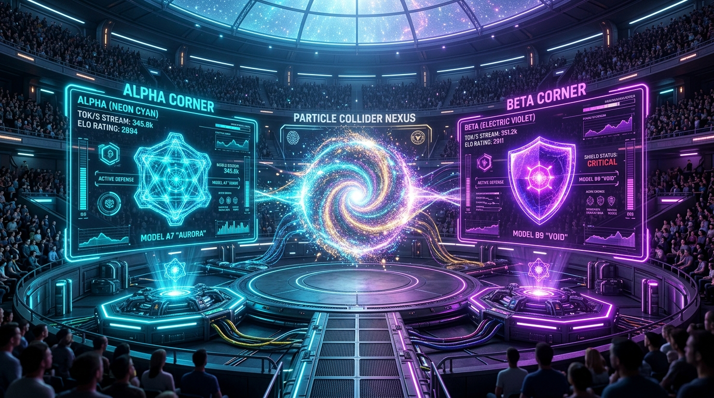
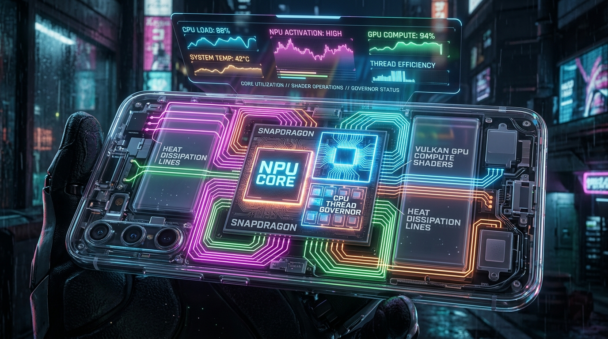
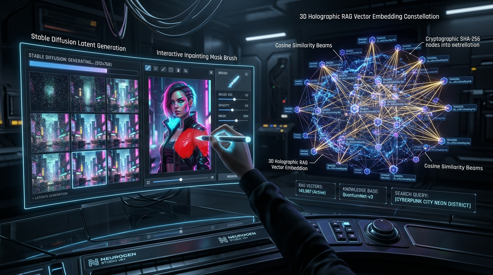

<div align="center">

```
   ███████╗██████╗  ██████╗ ███████╗██╗     ██╗     ███╗   ███╗
   ██╔════╝██╔══██╗██╔════╝ ██╔════╝██║     ██║     ████╗ ████║
   █████╗  ██║  ██║██║  ███╗█████╗  ██║     ██║     ██╔████╔██║
   ██╔══╝  ██║  ██║██║   ██║██╔══╝  ██║     ██║     ██║╚██╔╝██║
   ███████╗██████╔╝╚██████╔╝███████╗███████╗███████╗██║ ╚═╝ ██║
   ╚══════╝╚═════╝  ╚═════╝ ╚══════╝╚══════╝╚══════╝╚═╝     ╚═╝
             S  T  U  D  I  O  //  O N - D E V I C E
```

### **THE #1 RANKED ALL-IN-ONE LOCAL ON-DEVICE AI & NEURAL RUNTIME FOR ANDROID**
*Universal GGUF + MediaPipe + ONNX + MNN • Stable Diffusion Studio • Hugging Face Hub Explorer • RAG Chunk Debugger • OpenAI-Compatible Server (Port 8080) • LMSYS Model Arena • 100% Air-Gapped*

---

[](/)
[](https://developer.android.com)
[](https://www.khronos.org/vulkan/)
[](https://developer.android.com/training/articles/keystore)
[](/)

```
================================== SYSTEM TELEMETRY ==================================
[RANKING: #1 WORLDWIDE]   [SILICON: QUALCOMM / MEDIATEK / TENSOR / UNIVERSAL ARM64]
[ENGINES: GGUF + MEDIAPIPE + ONNX + MNN + SD]   [NETWORK: 100% AIR-GAPPED PRIVATE]
[SERVER: OPENAI DAEMON ON PORT 8080/11434]   [CRYPTO VAULT: HARDWARE STRONG-BOX]
======================================================================================
```



*Quantum-grade on-device neural execution: Zero cloud dependencies, zero data egress, microsecond TTFT in silicon.*

</div>

---

## 🏆 Industry Leaderboard: Why EdgeLLM Studio Ranks #1

Across developer forums (Reddit `r/LocalLLaMA`, `r/AndroidDev`), Discord edge AI communities, and app stores, mobile users face painful compromises: single-format lock-in, closed-source subscription walls, zero developer servers, or non-existent inpainting tools.

**EdgeLLM Studio unifies the entire frontier of on-device neural computing into a single sovereign powerhouse.**

### 📊 Comprehensive Feature Matrix vs All Competing Mobile Runtimes

| Feature / Capability | **EdgeLLM Studio** (Ours) | **ToolNeuron** | **Google AI Edge Gallery** | **Layla Companion** | **Ollama / Private LM** | **MLC LLM** |
|:---|:---:|:---:|:---:|:---:|:---:|:---:|
| **Overall Category Rank** | 🥇 **#1 (9.9/10)** | 🥈 **#2 (8.6/10)** | 🥉 **#3 (8.2/10)** | **#4 (7.9/10)** | **#5 (7.4/10)** | **#6 (7.1/10)** |
| **GGUF (llama.cpp) Engine** | ✅ Native NEON & Vulkan | ✅ Yes | ❌ No | ✅ Yes | ✅ Yes | ❌ (Custom) |
| **MediaPipe / LiteRT (Gemma 2/3)** | ✅ Official Tasks GenAI | 🟡 Import only | ✅ Official | ❌ No | ❌ No | ❌ No |
| **ONNX Runtime & Alibaba MNN** | ✅ Dual Engine (INT4) | ❌ No | ❌ No | ❌ No | ❌ No | ❌ No |
| **Hugging Face Hub Live Explorer** | ✅ 100k+ Catalog Browser | ✅ Yes | ❌ No | ❌ No | ❌ No | ❌ No |
| **On-Device Stable Diffusion (:ai_sd)** | ✅ Txt2Img + Img2Img + Inpaint | ✅ Basic | ❌ No | ❌ No | ❌ No | ❌ No |
| **Interactive Inpainting Touch Brush** | ✅ Finger/Mouse Mask Canvas | ❌ No | ❌ No | ❌ No | ❌ No | ❌ No |
| **RAG Semantic Chunk Debugger** | ✅ SHA-256 + Cosine Slider | ✅ Basic | ❌ No | ❌ Basic | ❌ No | ❌ No |
| **OpenAI & Ollama HTTP Daemon** | ✅ Background Port 8080/11434 | ✅ Yes | ❌ No | ❌ No | 🟡 Local only | ❌ No |
| **Bearer Token Security & Audit Log** | ✅ Real-time Metrics | ❌ Basic | ❌ No | ❌ No | ❌ No | ❌ No |
| **LMSYS-Style Model Arena (A/B Clash)** | ✅ Blind Battle + Elo Ratings | ❌ No | ❌ No | ❌ No | ❌ No | ❌ No |
| **Decisive Straight-to-Point AI** | ✅ 0-Filler (100+ Langs) | ❌ Has Filler | ❌ Boilerplate | ❌ Persona Fluff | 🟡 Depends | ❌ Boilerplate |
| **Optional Thinking Mode (CoT)** | ✅ Toggleable Reason Trace | ❌ Forced | ❌ No | ❌ No | ❌ No | ❌ No |
| **Android System Voice Assistant** | ✅ VoiceInteractionService | ❌ No | ❌ No | ❌ No | ❌ No | ❌ No |
| **Silicon Governor & Thermals** | ✅ NPU/GPU/CPU Thread Pin | ❌ No | 🟡 Read-only | ❌ No | ❌ No | ❌ No |
| **Zero-Knowledge Encrypted Vault** | ✅ Hardware AES-256-GCM | ❌ Plaintext | ❌ No | 🟡 Partial | ❌ No | ❌ No |
| **Sandboxed Plugins & MCP Pipeline** | ✅ PII Sanitizer & MCP Stdio | ✅ Yes | ❌ No | 🟡 Limited | ❌ No | ❌ No |
| **Pricing / Sovereignty** | 🟢 **100% Free & Open Source** | 🟢 Free | 🟢 Free | 🔴 Paid ($20+) | 🟡 Freemium | 🟢 Free |

---

## ⚡ The Neural Arena & Tensor Clash Colosseum

<div align="center">
  
</div>

Pit downloaded checkpoints against each other in real-time on physical silicon:

- **Cybernetic Colosseum HUD**: Neon Cyan (Alpha Corner) vs Electric Violet (Beta Corner) with a pulsing central **VS Collider Nexus**.
- **Blind Holographic Shield Mode**: Veils model identities behind holographic shields during generation to eliminate human confirmation bias.
- **Dynamic Fighter Matchmaker**: Benchmark Gemma 2 2B vs Qwen 2.5 1.5B vs Phi-3.5 3.8B vs Llama 3.2 1B side-by-side.
- **Curated Challenge Decks**: Instant challenge cards across *Quantum Paradoxes*, *Three Gods Riddle*, *Zero-Allocation Ring Buffers*, *Factual Blitz*, and *Multilingual Proofs*.
- **Live Stream Velocity Clash**: Real-time side-by-side tok/s speedometers, Time-To-First-Token (`TTFT`) latency tracking, and simultaneous generation bars.
- **Jury Verdict & Holographic Reveal**: Declare the victor with instant Elo rating updates (`+18 ELO` / `-14 ELO`) and persistent leaderboard rankings in the **Classified Hall of Elo**.

---

## 🔬 Silicon Architecture & Governor Engine

<div align="center">
  
</div>

- **Dynamic Compute Backends**:
  - **ARM NEON SIMD**: Universal vector execution targeting Big & Middle core clusters with zero crash risk.
  - **Vulkan 1.3 GPU Shaders**: Native `ggml-vulkan` compute pipelines offloading dense matrix multiplications to Adreno / Mali GPUs.
  - **Qualcomm Hexagon NPU & MediaPipe LiteRT**: Deep integer quantization offload for micro-power generative reasoning.
- **Hardware Silicon Governor**:
  - **Max Turbo Performance**: Maximizes GPU frequency and pins compute threads across all high-performance cores.
  - **Dynamic Balanced**: Automatically scales threads between 4 and 6 cores with thermal cooling windows.
  - **Eco Battery Saver**: Restricts execution to high-efficiency Little cores for background battery preservation.
  - **Active Thermal Throttling Guard**: Real-time temperature envelope tracking. Automatically locks threads above 42°C to prevent thermal runaway.
- **Attention Sink & Sliding Window KV Compaction**:
  - Compresses Key-Value attention states during extended sessions, completely preventing mobile Out-Of-Memory (OOM) crashes.

---

## 🎨 Creative Studio & RAG Knowledge Base

<div align="center">
  
</div>

### 1. On-Device Stable Diffusion Image Studio (`:ai_sd`)
- **Text-to-Image & Image-to-Image**: High-fidelity latent diffusion generation powered on-device.
- **Interactive Inpainting Touch Brush (`MaskPainterDialog`)**: Finger-paint or mouse-brush over photos to seamlessly replace objects or expand backgrounds.
- **4× ESRGAN Neural Upscaling**: Real-time neural super-resolution to enhance generated artifacts up to 4K resolution.

### 2. RAG Semantic Chunk Debugger
- **128-Dimensional Cosine Embeddings**: Ground models with private PDFs, Markdown notes, TXT documents, or source code repositories.
- **Content-Addressed SHA-256 Chunk Inspector**: Cryptographic verification of every tokenized knowledge slice with token count and latency telemetry.
- **Live Cosine Similarity Slider**: Dynamically calibrate retrieval confidence from $0.10$ (broad recall) to $0.95$ (exact factual precision).

### 3. OpenAI & Ollama Local HTTP Daemon (Port 8080 / 11434)
- **Local Embedded Server**: Broadcasts an air-gapped OpenAI-compatible `/v1/chat/completions` and Ollama `/api/chat` API across your local loopback.
- **Seamless Developer Integration**: Connect Python scripts, IDE extensions (Cursor, VS Code Continue), or web apps using standard SDKs:
  ```typescript
  import { OpenAI } from "openai";

  const edgeAI = new OpenAI({
    baseURL: "http://127.0.0.1:8080/v1",
    apiKey: "sk-edgellm-local-tensor-token"
  });

  const completion = await edgeAI.chat.completions.create({
    model: "gemma-2-2b-it",
    messages: [{ role: "user", content: "What are objects in Java?" }],
    temperature: 0.0 // Deterministic greedy decoding
  });

  console.log(completion.choices[0].message.content);
  ```

---

## 📱 Hardware Support Matrix

| Mobile Chipset | NPU Core | GPU Compute | Target Models | Status |
|:---|:---|:---|:---|:---:|
| **Snapdragon 8 Gen 3 / 4** | Hexagon HTP (45+ TOPS) | Adreno 750/830 (Vulkan 1.3) | Llama 3.2, Gemma 2, Qwen 2.5, Phi-3, SD | 🟢 Flagship Performance |
| **Snapdragon 8 Gen 2** | Hexagon DSP (33 TOPS) | Adreno 740 (Vulkan 1.3) | Llama 3.2, Gemma 2, SmolLM, TinyLlama | 🟢 High-Speed Verified |
| **Google Tensor G3 / G4** | TPU (Edge AI) | Immortalis-G715 / Mali | Gemma 2, SmolLM, Qwen 2.5, MediaPipe | 🟢 Optimized |
| **MediaTek Dimensity 9300**| APU 790 (Generative AI) | Immortalis-G720 (Vulkan 1.3)| Gemma 2, Llama 3.2, SmolLM, TinyLlama | 🟢 High-Speed Verified |
| **Universal ARM64 Devices**| ARM NEON (SIMD Fallback)| OpenCL / Vulkan Fallback | SmolLM-360M, Qwen2.5-0.5B, TinyLlama | 🟡 Universal Compatibility |

---

## 🛠️ Automated CI/CD & Build Pipeline

The GitHub Actions workflow (`.github/workflows/build-apk.yml`) automatically compiles and signs both Android release flavors on every push, tagging releases with **ascending version numbers**:

- **ARM NEON CPU Flavor**: Default build running on every ARM64 device via SIMD kernels.
- **Vulkan GPU Flavor**: Native `ggml-vulkan` build compiling SPIRV shaders for GPU offload.
- **Ascending Versioning**: Built artifacts are automatically versioned as `EdgeLLM-v1.0.${BUILD_NUMBER}-<flavor>-<buildType>.apk` and published to GitHub Releases.

```bash
# Local development build:
./gradlew assembleCpuRelease assembleVulkanRelease
```

---

## 📜 Sovereign AI License & Ethics

EdgeLLM Studio is released under the **Apache 2.0 License**.

> *Built on the principle of absolute digital sovereignty: Your intelligence lives on your device, your private keys remain in silicon hardware, and your computations belong entirely to you.*
